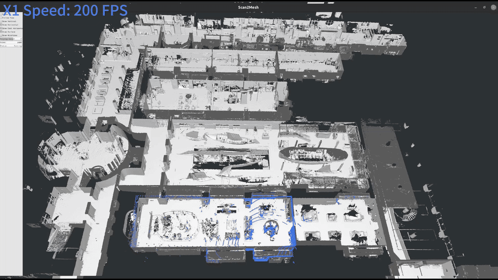
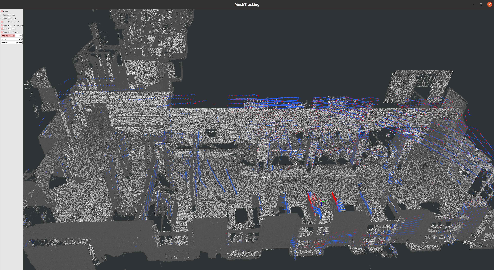
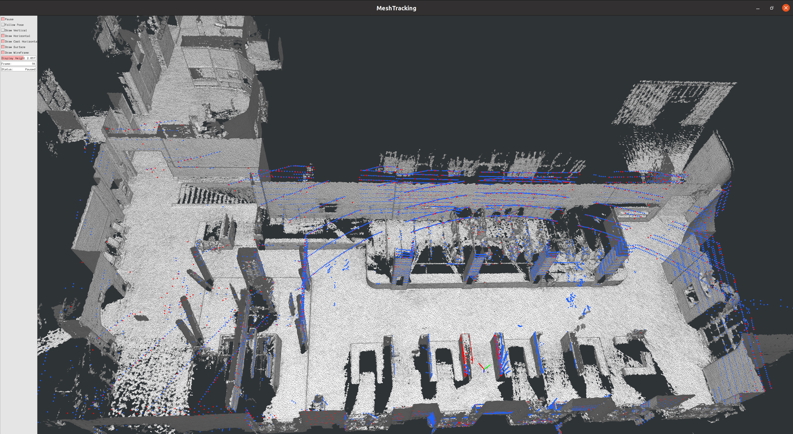
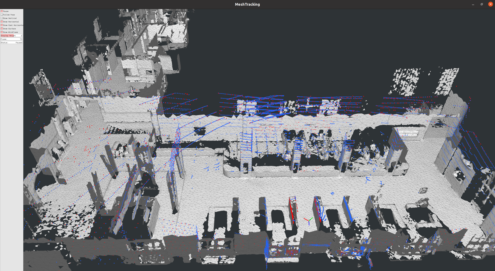
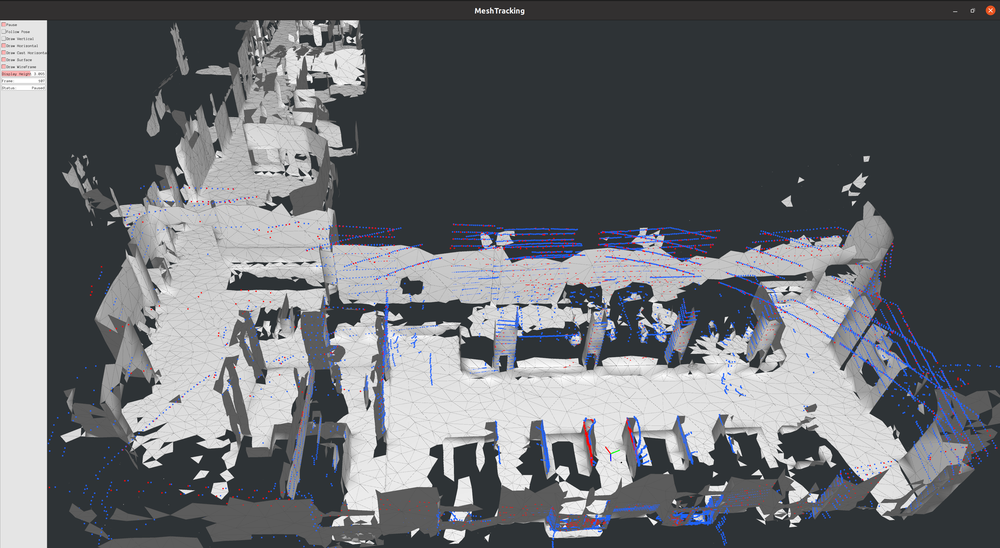

# Scan2Mesh

Scan2Mesh is a high-performance mesh-based LiDAR localization and tracking system that estimates LiDAR poses by aligning incoming scans with a pre-built 3D mesh. It achieves real-time tracking rates of **up to 200 Hz using only a single CPU core**, tested on an Intel Core i9-10900K and NVIDIA GeForce RTX 3080 Ti.

The system uses Embree for CPU-based mesh raycasting and CUDA for accelerated ICP computation and reduction. Pangolin provides real-time visualization, while URDFDOM loads sensor configurations from URDF files.

Raycasting is currently the primary performance bottleneck. Replacing the CPU-based Embree pipeline with GPU-accelerated raycasting using CUDA, OptiX, or Vulkan Ray Tracing could significantly increase overall tracking performance.

## Compact Mesh Representation

Scan2Mesh remains reliable with highly simplified meshes as long as the main geometric structure of the environment is preserved.

A **3,000 m² scene can be represented by a mesh of approximately 0.6 MB** while maintaining reliable tracking.

This compact map representation enables:

* **Low storage and memory requirements**
* **Fast deployment and network distribution**
* **Scalable management of large numbers of environments**
* **Deployment on embedded and edge devices**

These advantages make Scan2Mesh well suited for large-scale deployment and cloud or edge-based localization systems.



## Requirements

The following dependencies are required:
| Dependency | Purpose                      |
| ---------- | ---------------------------- |
| CUDA       | GPU acceleration             |
| Embree 4   | High-performance ray tracing |
| PCL 1.9    | Point cloud processing       |
| Pangolin   | Visualization                |
| Boost      | Threading and serialization  |
| URDFDOM    | URDF parsing                 |
| CMake      | Build system                 |

---

### PCL

This project is tested with **PCL 1.9**.

Other PCL versions may also work, but compatibility has not been tested or verified. By default, CMake searches for PCL in the following location:

```bash
$HOME/software/pcl_install
```

The PCL version and installation path are specified in `CMakeLists.txt`:

```cmake
find_package(PCL 1.9 EXACT REQUIRED
  PATHS "$ENV{HOME}/software/pcl_install")
```

Please make sure that PCL 1.9 is installed in this location before building the project.

## CUDA Architectures

CUDA binaries are generated for the following GPU architectures:

```text
60 61 62 70 72 75 80 86
```

If your GPU architecture is not listed, update `CUDA_ARCH_BIN` in `CMakeLists.txt`:

```cmake
set(CUDA_ARCH_BIN "60 61 62 70 72 75 80 86")
```

# Build

Clone or enter the project directory:

```bash
cd scan2mesh
mkdir build
cd build
cmake ..
make -j$(nproc)
```

# Running Mesh Tracking

This example uses data from the [Cartographer Deutsches Museum dataset](https://google-cartographer-ros.readthedocs.io/en/latest/data.html#d-cartographer-backpack-deutsches-museum-1). The reference mesh was reconstructed at a **2.5 cm resolution** using our **Eternelle3D** reconstruction algorithm. After compilation, run the `mesh_tracking` executable from the build directory. Example:

```bash
./mesh_tracking \
  -m ${HOME}/node_data/b3-2016-03-01-13-39-41_mesh_0.1.ply \
  -d ${HOME}/node_data/ \
  -u ${HOME}/scan2mesh/src/backpack_3d.urdf \
  -vs
```

## Command Line Arguments

| Option | Description                                                                                      |
| ------ | ------------------------------------------------------------------------------------------------ |
| `-m`   | Path to the reference mesh used for LiDAR tracking and raycasting.                               |
| `-d`   | Path to the input data directory containing LiDAR and sensor data.                               |
| `-u`   | Path to the URDF sensor configuration file defining sensor poses and coordinate transformations. |
| `-vs`  | Enable real-time visualization using Pangolin.                                                   |

## Mesh Simplification

The 2.5CM resolution mesh created by Eternelle3D can be significantly simplified using **Quadric Error Metrics (QEM) mesh decimation** while preserving the overall geometric structure required for LiDAR tracking.

QEM-based decimation reduces the number of triangles by iteratively collapsing edges while minimizing the geometric error introduced to the mesh. This allows the mesh size to be dramatically reduced while retaining the major surfaces and structural features of the environment.

<table>
<tr>
<td align="center">

2.5cm Resolution Mesh Created by Eternelle3D
</td>

<td align="center">

QEM Decimation × 0.1
</td>
</tr>

<tr>
<td align="center">

QEM Decimation × 0.01
</td>

<td align="center">

QEM Decimation × 0.001
</td>
</tr>
</table>

## FAQ

**Q: How should I tune the tracking parameters?**

The tracking parameters can be adjusted according to the quality of the initial pose and the desired tracking performance.

* **`dist_thresh`** (default: `2.0 m`): If a reliable initial pose is available from an IMU or another localization source, this value can be reduced accordingly. A smaller threshold reduces the search range and can improve tracking efficiency and robustness.
* **Adaptive Voxel Point Number** (default: `2000`): Controls the number of points retained after voxel downsampling. This value can be tuned based on the desired balance between tracking accuracy, robustness, and computational performance. Increasing the point count may improve tracking quality, while reducing it can increase processing speed.

**Q: Does mesh size affect tracking performance?**

Yes. Larger and more complex meshes generally increase raycasting time, which can reduce the overall tracking rate. However, Scan2Mesh can still handle large-scale environments efficiently. In our tests, a **300 MB mesh covering approximately 50,000 m²** can achieve real-time tracking rates of **up to 150 Hz**.

**Q: What QEM decimation ratio should I use for the mesh?**

The initial mesh is generated at **2.5 cm resolution** using Eternelle3D. In practice, a **50×–100× QEM decimation ratio** can significantly reduce the mesh size while retaining sufficient geometric details for reliable tracking.

For example, a decimated mesh covering approximately **50,000 m²** can be kept to around **200 MB of memory** while still providing good tracking performance. The optimal decimation ratio depends on the scene geometry and the required tracking accuracy.

**Q: Why are the raycasted points not exactly the same as the input LiDAR points?**

1. **LiDAR motion distortion** — points are measured at different times while the sensor is moving, but raycasting assumes a single fixed LiDAR pose.
2. **Sensor calibration & measurement errors** — small LiDAR–mesh extrinsic errors, angular calibration errors, and measurement noise can cause slight offsets.
3. **Mesh approximation** — raycasting hits the reconstructed/decimated mesh, which may not exactly represent the real measured surface.

## License

Scan2Mesh is source-available under the Eternelle Non-Commercial License.

The source code may be used, modified, and distributed for non-commercial
purposes, including research, education, and evaluation.

Commercial use requires a separate commercial license from the Eternelle Authors. For commercial licensing, please contact us.